**Power CAT | The Intelligent Enterprise - Power Platform & AI for Frontier Firms**

# MCP Apps

*Enable Power Apps and custom tools in Microsoft 365 Copilot.*


## Contents

- [Lab overview](#lab-overview)
- [Core concepts](#core-concepts)
- [Documentation and learning resources](#documentation-and-learning-resources)
- [Prerequisites](#prerequisites)
- [Lab steps](#lab-steps)
  - [Prerequisite setup steps](#prerequisite-setup-steps)
  - [Part 1 — Enable Power Apps in Microsoft 365 Copilot](#part-1--enable-power-apps-in-microsoft-365-copilot)
  - [Part 2 — Add a custom MCP tool with a map widget](#part-2--add-a-custom-mcp-tool-with-a-map-widget)
- [Recap](#recap)

## Lab overview

In this hands-on lab you transform an existing model-driven app — the **Admin Management App** in the Northwind Traders solution — into a Microsoft 365 Copilot experience. Part 1 generates a declarative agent from the app, sideloads it to Microsoft Teams, and tests interactive grids and forms inside Copilot. Part 2 extends that agent with a custom MCP tool and a self-contained HTML widget that visualizes orders on an interactive map.

By the end of the lab you will have a published Copilot agent that can browse, view, and edit Dataverse records via natural language, plus a custom **Orders map** tool that returns JSON and renders it as a clickable, theme-aware Fluent UI map widget directly inside the Copilot Chat conversation.

> [!IMPORTANT]
> Power Apps in Microsoft 365 Copilot is currently a public-preview feature. MCP Apps support in Microsoft 365 Copilot Chat is generally available as of March 2026, but Power Apps support for MCP Apps in declarative agents remains in public preview. Preview features are not intended for production workloads and may change before general availability.

### Core concepts

| Concept | Why it matters |
|----|----|
| **MCP Apps** | MCP Apps is an extension to the Model Context Protocol that enables MCP servers to deliver interactive user interfaces to hosts. It defines how servers declare UI resources, how hosts render them securely in iframes, and how the two communicate. |
| **Declarative agent package** | A Microsoft 365 Copilot agent definition packaged as a `.zip`; it bundles the MCP server reference and built-in tools. The package is uploaded to Teams or published via the Microsoft 365 admin center to deploy your Copilot agent. |

### Documentation and learning resources

- [Enable your app and custom tools in Microsoft 365 Copilot](https://learn.microsoft.com/power-apps/maker/model-driven-apps/enable-your-app-copilot)
- [Generate MCP app widgets with AI code generation tools](https://learn.microsoft.com/power-apps/maker/model-driven-apps/generate-mcp-app-widgets)
- [Enable custom Teams apps and configure custom app upload settings](https://learn.microsoft.com/microsoftteams/platform/concepts/build-and-test/prepare-your-o365-tenant#enable-custom-teams-apps-and-configure-custom-app-upload-settings)
- [Upload your custom app in Teams](https://learn.microsoft.com/microsoftteams/platform/concepts/deploy-and-publish/apps-upload)
- [Declarative agents for Microsoft 365 Copilot (extensibility)](https://learn.microsoft.com/microsoft-365-copilot/extensibility/overview-declarative-agent)
- [AI prompts environment setting](https://learn.microsoft.com/power-platform/admin/settings-features#ai-prompts)
- [MCP Apps overview](https://apps.extensions.modelcontextprotocol.io/api/documents/Overview.html)

### Prerequisites

- Review the consolidated workshop prerequisites before you begin: [Workshop prerequisites](../prereqs.md)
- Import [Northwind Traders](https://github.com/microsoft/apps-agents-workshop/blob/main/solutions) to the environment and seed with data. [Follow the Northwind Traders solution import and sample data instructions](../../solutions/README.md).
- A Microsoft 365 Copilot license for both the maker building the agent and the end users interacting with it.
- Permission to upload custom apps in Microsoft Teams. Your Microsoft 365 admin must enable this on the Global Setup policy in the Teams admin center — detailed instructions are in Step 1.
- AI prompts environment setting enabled in your environment — required to author custom tools in Part 2. If disabled, you will see the error "This feature has been disabled" when you choose **Create custom tool**. For more information, see [AI prompts environment setting](https://learn.microsoft.com/power-platform/admin/settings-features#ai-prompts).
- Visual Studio Code and GitHub Copilot CLI installed.

> [!NOTE]
> Custom Teams app upload is not available in Government Community Cloud High (GCC High), Department of Defense (DoD), or Teams operated by 21Vianet. Use the Microsoft 365 admin center publishing path for those environments. See the Teams documentation linked above.

## Lab steps

### Prerequisite setup steps

Complete these one-time setup tasks before working through Part 1 and Part 2. They configure your Microsoft 365 tenant for custom Teams app upload and install the MCP Apps widget skill into your code-generation CLI.

#### Step 1: Enable Upload custom apps in the Teams Global setup policy

Sign in to the **Microsoft Teams admin center** with admin credentials. In the left navigation, expand **Teams apps** and select **Setup policies**. Open the **Global (Org-wide default)** policy, toggle **Upload custom apps** to On, then choose **Save**.

> [!IMPORTANT]
> Propagation can take up to 24 hours. If the **Upload a custom app** option is missing from your Teams client later, wait, then re-check the policy assignment for your user.

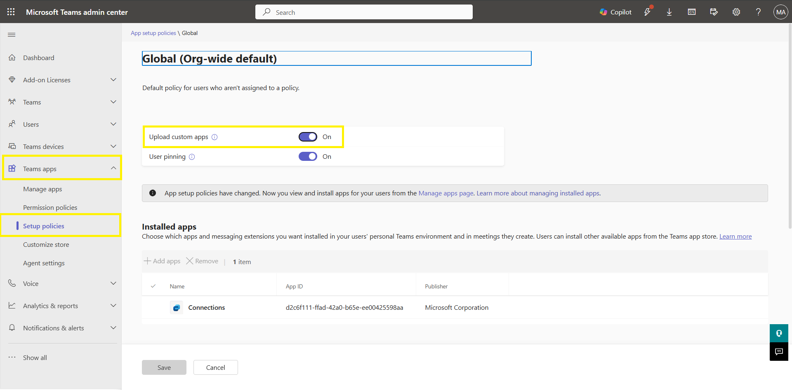  
Figure: Teams admin center → Teams apps → Setup policies → Global, with the "Upload custom apps" toggle.

#### Step 2: Open GitHub Copilot CLI

On your workstation create a new folder named `MCPApp` (any path is fine) and open it in Visual Studio Code. Open the integrated terminal and start your code-generation CLI of choice — this lab uses **GitHub Copilot CLI**.

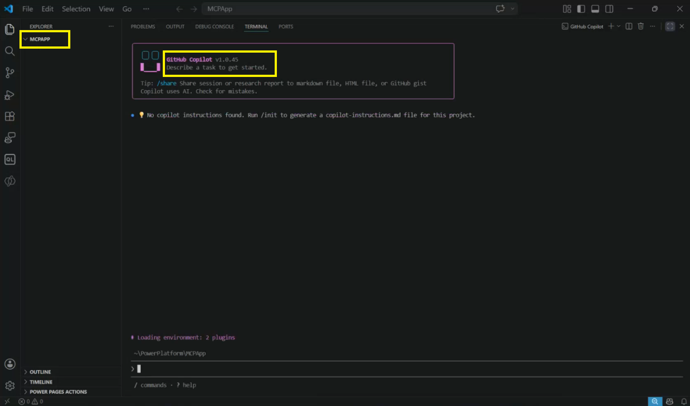  
Figure: VS Code with the new "MCPApp" folder open and an integrated terminal running the GitHub Copilot CLI.

#### Step 3: Add the Power Platform Skills marketplace

In the CLI, add the marketplace that hosts the MCP Apps plugin.

Run the command:

```text
/plugin marketplace add microsoft/power-platform-skills
```

#### Step 4: Install the MCP Apps plugin

Install the plugin needed for this lab.

Run the command:

```text
/plugin install mcp-apps@power-platform-skills
```

#### Step 5: Confirm the plugin is loaded

Verify the install and reload your CLI so the new skill is registered.

Run the command:

```text
/plugin list
```

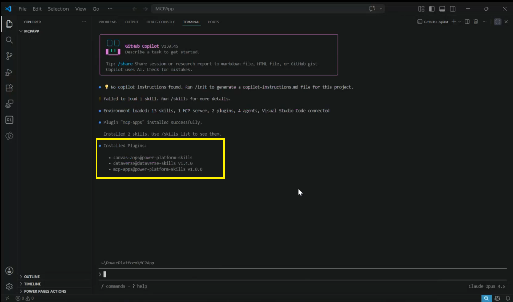  
Figure: GitHub Copilot CLI showing the `/plugin list` output with the `mcp-apps` skill present in the table.

Restart Copilot CLI once the plugin is installed by running the `/restart` command.

### Part 1 — Enable Power Apps in Microsoft 365 Copilot

In Part 1 you turn the existing Admin Management App into an MCP-enabled Copilot agent. You provision the MCP server in Power Apps Studio, download the generated declarative agent package, sideload it into Microsoft Teams, and exercise the built-in tools by chatting with the agent in Microsoft 365 Copilot.

#### Step 6: Open the Admin Management App

Sign in to <https://make.powerapps.com> as the maker and confirm you are in the environment that has the **Northwind Traders** solution. Open the solution, locate the **Admin Management App** model-driven app, and choose **Edit** to open it in Power Apps Studio.

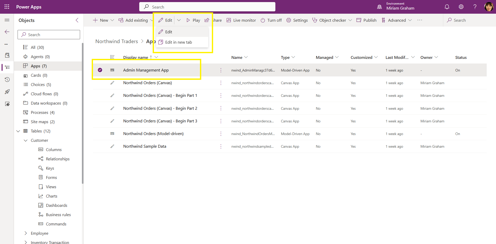  
Figure: Northwind Traders solution view with the Admin Management App.

#### Step 7: Open the App MCP pane and set up MCP

In the Power Apps Studio left navigation, select the **App MCP** icon. Choose **Set up MCP** to provision the MCP server for this app. This is a one-time action that takes a few seconds to complete.

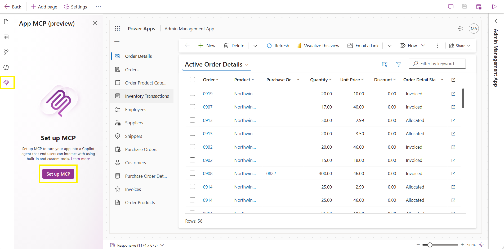  
Figure: Power Apps Studio with the App MCP pane open and the Set up MCP button visible before activation.

#### Step 8: Review the built-in tools and publish the app

After setup completes, the App MCP pane lists the built-in tools that are now available to Copilot: **Create record**, **Edit record**, **View record**, and **View data**. These are wired automatically to every table exposed by the app. Choose **Save** then **Publish** to publish the app.

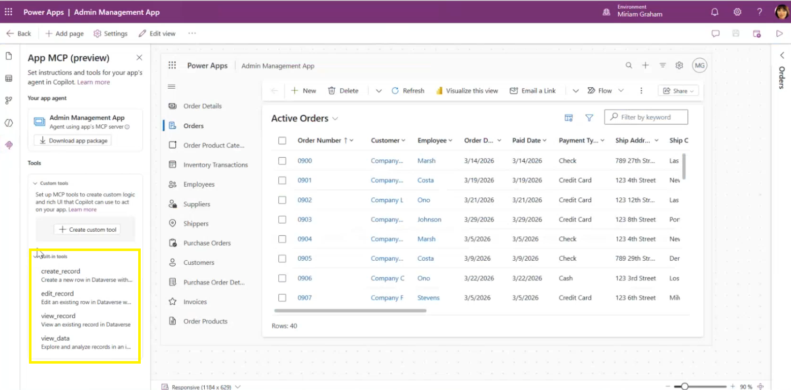  
Figure: App MCP pane listing the four built-in tools (create record, edit record, view record, view data).

#### Step 9: Download the declarative agent app package

Still in the App MCP pane, choose **Download app package**. A `.zip` file named similarly to `declarative-agent-admin-management-app.zip` downloads to your local machine. The package contains the agent definition, the built-in tools for records and data, and the configuration needed to deploy the experience to Microsoft 365 Copilot.

#### Step 10: Sideload the agent package into Teams

Open the Microsoft Teams desktop or web client. In the left rail choose **Apps**, then **Manage your apps**, then **Upload an app**. Select **Upload a custom app** and choose the `.zip` you downloaded in Step 9. Teams displays the agent details — confirm the name (for example, **Admin Management App**) and the overview text, then choose **Add**.

> [!TIP]
> Don't see **Upload a custom app**? Re-check Step 1 — the Global Setup policy must have **Upload custom apps** enabled, and the change can take up to 24 hours to reach your user. You can sign out and back in to refresh the policy.

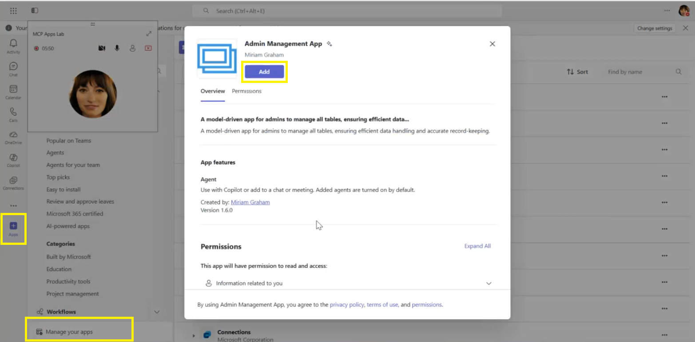  
Figure: Teams Upload a custom app dialog showing the agent name "Admin Management App" and Add button.

Now exercise the four built-in tools by asking the agent natural-language questions about your app's data.

#### Step 11: Open the agent in the Copilot tab

In Teams, switch to the **Copilot** tab. Locate the **Admin Management App** agent in the agent list and open it. The first time you talk to the agent it prompts you to connect to the app — choose **Allow** to authorize Copilot to call the MCP server.

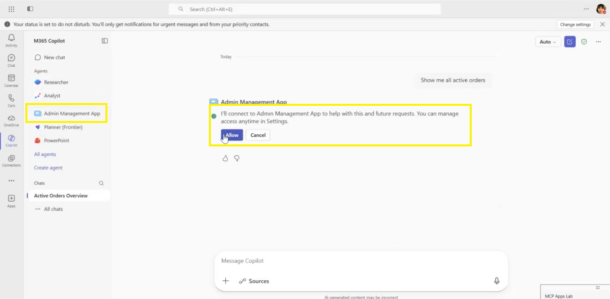  
Figure: Copilot tab in Teams with the Admin Management App agent selected and the first-run "Allow" connection prompt visible.

#### Step 12: Browse records with the view data tool

Enter the following prompt in the agent chat:

```text
Show me all active orders
```

Copilot invokes the **View data** tool. You should see an interactive grid listing active orders. Select a record in the grid to open an interactive form view that surfaces the record's detail — the **View record** tool. You can edit fields directly from the form (the **Edit record** tool) without leaving the Copilot conversation.

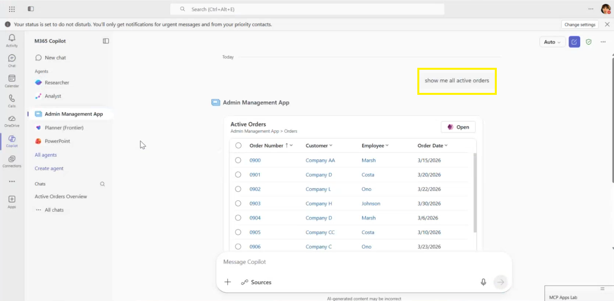  
Figure: Copilot Chat showing the interactive grid response to "Show me all active orders".

#### Step 13: Create a record from Copilot

Enter the following prompt:

```text
Create a new order
```

Copilot invokes the **Create record** tool and renders an interactive form inside the chat. Fill the required fields, choose **Save**, and confirm that Copilot reports "Your changes have been saved successfully." Verify by asking:

```text
Show me all the new orders
```

The grid should now include the record you just created. Drill into it to confirm the values you entered persisted.

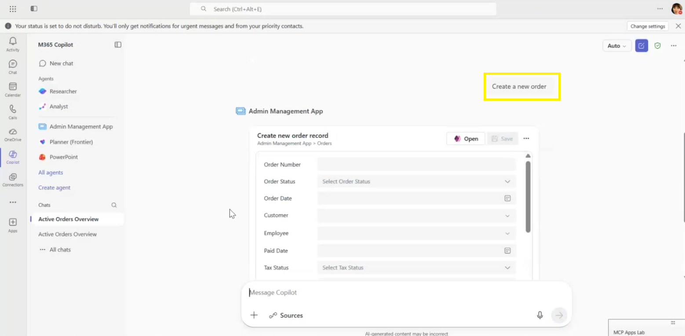  
Figure: Copilot Chat showing the interactive create order form.

### Part 2 — Add a custom MCP tool with a map widget

In Part 2 you extend the agent with a custom MCP tool that returns active orders as JSON, generate a self-contained Fluent UI map widget from that JSON using the `/mcp-apps:generate-mcp-app-ui` skill, wire the widget into the tool, redeploy the agent, and verify the live experience inside Microsoft 365 Copilot Chat.

#### Step 14: Create the Orders map custom tool

Back in <https://make.powerapps.com>, open the Northwind Traders solution and edit the Admin Management App again. In the **App MCP** pane, scroll to the **Tools** section and choose **Create custom tool**. Set:

- Name: `Orders map`
- Description: `Visualizes the orders on the map.`

> [!IMPORTANT]
> If you see the error "This feature has been disabled" when you choose **Create custom tool**, the AI prompts environment setting is turned off in this environment. A Power Platform admin must enable it before you can continue. See the Microsoft Learn [AI prompts environment setting](https://learn.microsoft.com/power-platform/admin/settings-features#ai-prompts) article for the activation steps.

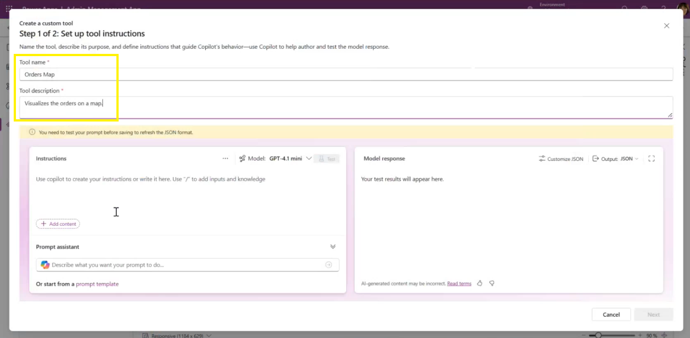  
Figure: App MCP → Tools → Create custom tool dialog.

#### Step 15: Add instructions and reference the Orders table

In the instructions area, type **Return the order details**. Then select **Add content** (or type `/` inline) and choose **Dataverse**. Pick the **Orders** table and select the columns the widget will need:

- `Order Date`
- `Order Number`
- `Order Status`
- `Ship City`
- `Ship Country_Region`
- `Status`

Confirm the **Output format** is set to **JSON** — the widget skill requires real JSON, not text.

> [!NOTE]
> Tool name and description matter: Microsoft 365 Copilot uses both fields when deciding which tool to invoke. Keep them descriptive and unambiguous.

#### Step 16: Test the tool and copy the JSON output

Choose **Test** to run the tool. The tool shows the JSON response containing the selected columns. Copy the full JSON payload to your clipboard — you will paste it into the widget generator in Step 17. Then choose **Next** to move to the widget code area.

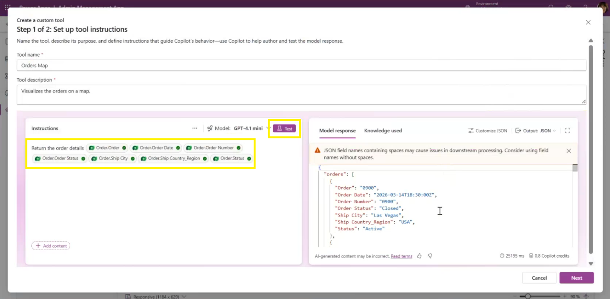  
Figure: Tool designer Test panel showing the JSON response.

#### Step 17: Invoke the widget skill with the JSON output

Back in the Copilot CLI, run the following prompt:

```text
/mcp-apps:generate-mcp-app-ui
Visualizes the orders on a map based on Ship City and Ship Country_Region.
Here's a sample output from the tool:
{ ...paste the JSON copied from Step 16 here... }
```

Accept any file-system prompts. The skill writes a self-contained file — for example, `orders-map-widget.html` — into your working folder and prints a summary of the widget it generated.

> [!IMPORTANT]
> Paste the real JSON from your tool, not mock data. The skill analyzes the actual JSON shape to choose the visual and bindings. Mock data produces widgets that break when the tool runs against live data.

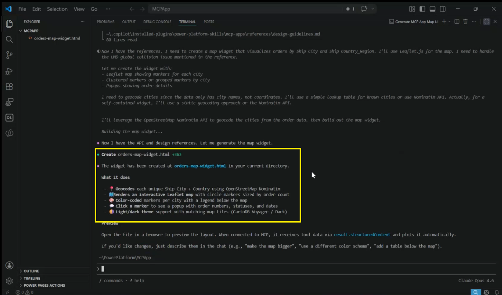  
Figure: Copilot CLI conversation showing the `/mcp-apps:generate-mcp-app-ui` invocation and the agent's summary after `orders-map-widget.html` is created.

#### Step 18: Add a standalone HTML preview

Open the generated HTML in a browser. If you only see a placeholder message such as "Plotting orders on a map", the widget expects to be hosted by the MCP host and cannot run standalone yet. Ask the agent to add a fallback preview:

```text
Add a standalone HTML preview.
```

The agent re-renders the file so it falls back to embedded sample data when opened outside a host but still connects to the live tool inside Microsoft 365 Copilot. Refresh the browser tab to see the rendered map.

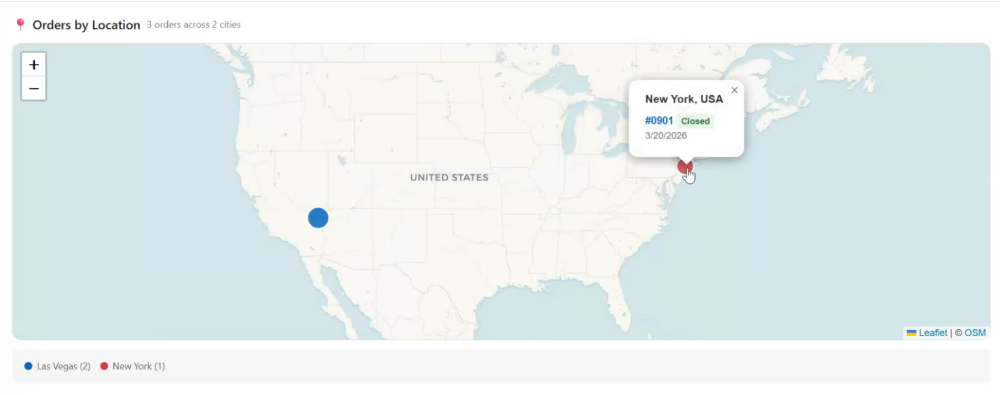  
Figure: Browser tab showing the orders map widget rendered with pins for each ship city after the standalone preview is added.

#### Step 19: Iterate — click to show order details

Refine the widget UX in natural language. Ask the agent:

```text
On click of the order, show its details in a form below the map.
```

The agent edits the HTML so that clicking a pin or list item reveals an order detail form below the map. Refresh the browser tab to verify the new interaction.

> [!TIP]
> Continue refining with natural language — for example, "make the pins use brand color", or "fit in 250 pixels with no scroll bars".

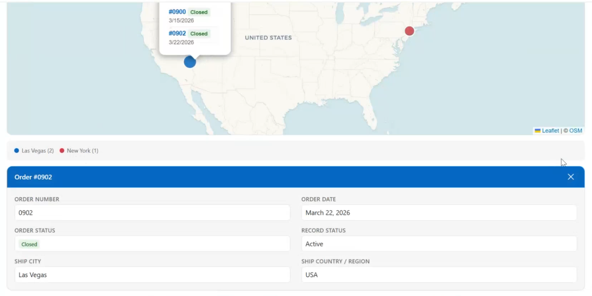  
Figure: Browser preview of the widget with a selected pin and the resulting order detail form rendered underneath the map.

#### Step 20: Paste the HTML into the tool's widget code area

Copy the full contents of the generated HTML file. Back in the **Orders map** custom tool in Power Apps Studio, paste the HTML into the widget code area. Choose **Save** to attach the widget to the tool.

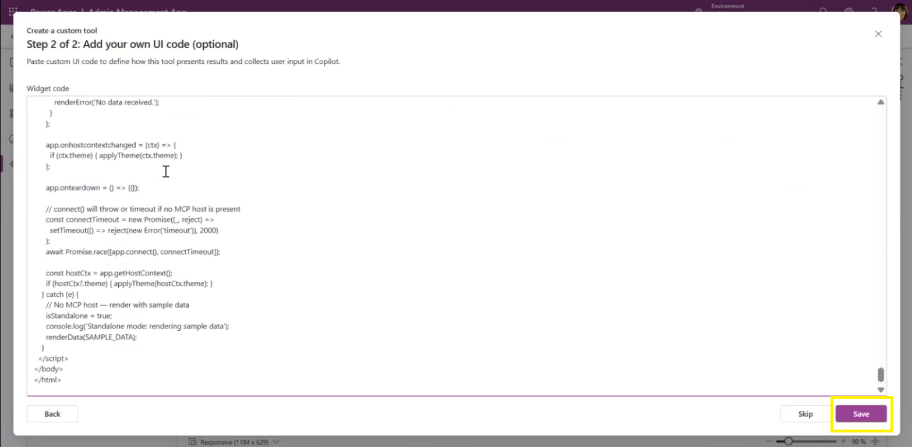  
Figure: Custom tool designer widget code area populated with the generated HTML, with the Save button highlighted.

#### Step 21: Publish and download the updated app package

Choose **Publish** on the app to push the new tool live, then return to the App MCP pane and select **Download app package** to get the updated `.zip`.

#### Step 22: Re-upload the updated package to Teams

In Teams, go to **Apps → Manage your apps → Upload an app → Upload a custom app** and select the new `.zip`. Choose **Add** to install the new version.

#### Step 23: Ask Copilot to render the orders on the map

In the Copilot tab, return to the Admin Management App agent and enter:

```text
Show me all active orders on the map
```

Copilot reasons over the user intent, recognizes that the **Orders map** tool matches, calls the MCP server for the JSON, and renders the widget you generated inline in the chat. Click a city pin to see the orders for that city, then click a single order to expand the detail form below the map.

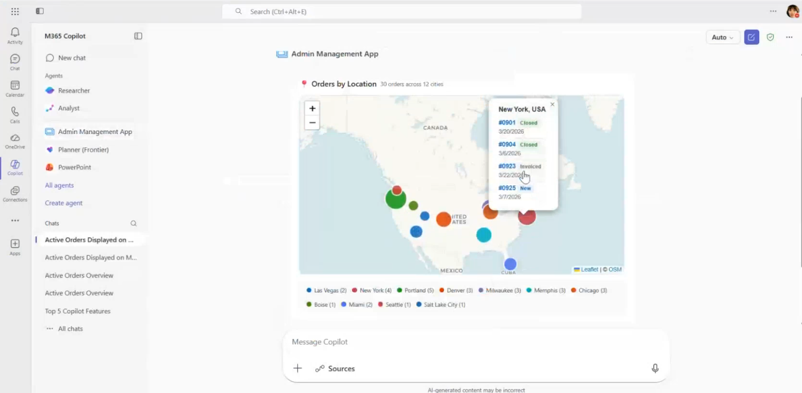  
Figure: Copilot Chat showing the Orders map widget rendered.

## Recap

- You provisioned an MCP server on the Admin Management App through the App MCP pane and downloaded the generated declarative agent package.
- You sideloaded the agent into Microsoft Teams and validated the four built-in tools (**view data**, **view record**, **edit record**, **create record**) inside Copilot Chat.
- You authored a custom MCP tool named **Orders map**, scoped it to the relevant Orders columns, and confirmed the JSON output.
- You generated a self-contained, theme-aware Fluent UI map widget from the real JSON, added a standalone preview, and iterated on the UX in natural language.
- You paired the widget HTML with the tool, republished the app, refreshed the Teams sideload, and verified the live experience inside Microsoft 365 Copilot.

🥳 **Congratulations! You have completed the MCP Apps Lab.**
