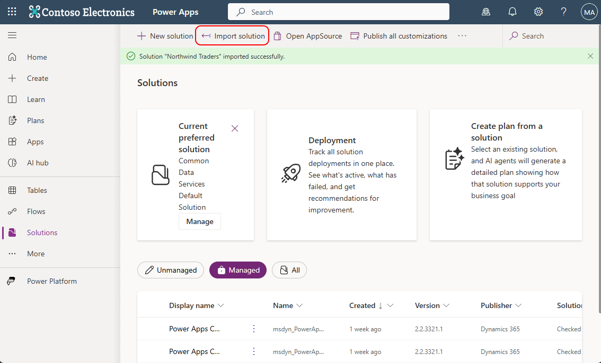
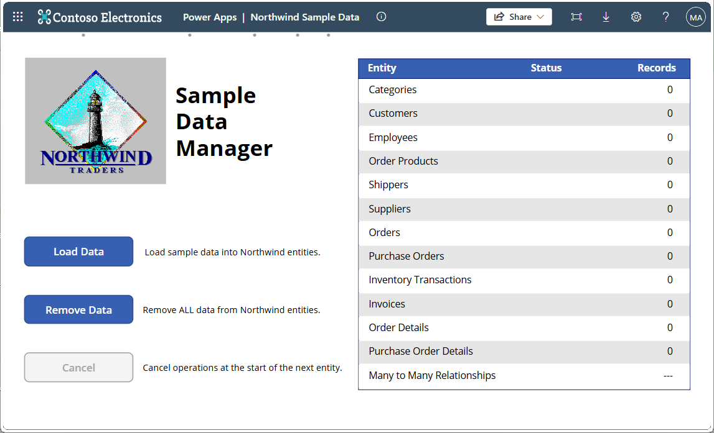
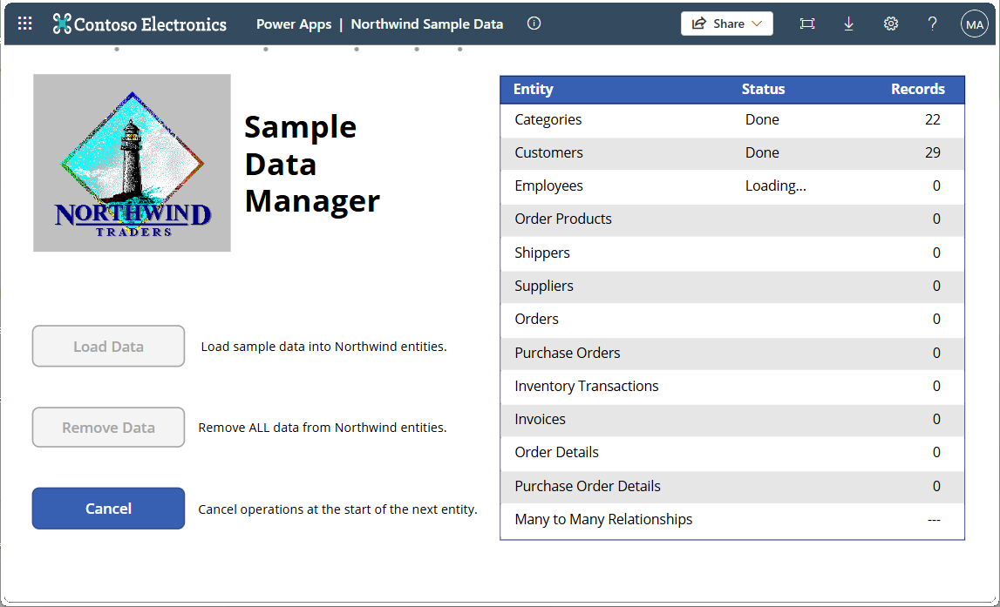

# Solutions

This folder contains the managed and unmanaged solutions used in the workshop labs.

| Solution | Description |
| --- | --- |
| Northwind Traders | Sample data solution used by the workshop labs. Always use the newest Northwind Traders package in this folder. |

## Version history

| Version | Changes |
| --- | --- |
| 1.0.0.15 | Adds the **Supplier Onboarding Agent**, a Microsoft Copilot Studio agent used by the optional **Ask an Agent** extension in the [BYOC Power Apps Code Apps lab](../labs/byoc-powerapps/byoc-powerapps.md). |
| 1.0.0.14 | Adds **Instant flow for app** for the optional Power Automate extension in the [BYOC Power Apps Code Apps lab](../labs/byoc-powerapps/byoc-powerapps.md). Also adds the **Northwind Traders Data Seeder** code app for validating the solution schema and seeding or refreshing Northwind sample data. |
| 1.0.0.12 | Adds the **Weather Details** custom connector used by the optional weather extension in the [BYOC Power Apps Code Apps lab](../labs/byoc-powerapps/byoc-powerapps.md). |

Each newer package includes the additions from the versions listed below it. Use the newest package for the complete workshop experience.

## Installing sample data

Follow these steps to import the Northwind Traders solution into your Power Platform environment and seed it with sample data.

### Step 1: Import the solution

1. Go to <https://make.powerapps.com> and select the environment you want to use.
2. In the left navigation, select **Solutions**.
3. Select **Import solution**.
4. Select **Browse** and choose the newest `NorthwindTraders_*.zip` package from the `solutions` folder of this repository.
5. Select **Next**, review the details, and select **Import**.
6. Wait for the import to complete. A confirmation message appears when the solution is successfully installed.

Figure: Importing the Northwind Traders solution from the Solutions page.

### Step 2: Seed the Northwind data

Choose either of the following methods to populate the Dataverse tables with sample records.

#### Option 1: Run the Northwind Sample Data app

Once the solution is imported, use the included **Northwind Sample Data** canvas app to populate the Dataverse tables with sample records.

1. In **Solutions**, open the **Northwind Traders** solution.
2. Locate the **Northwind Sample Data** app and select **Play** to launch it.
3. In the app, select **Load Data**.
4. Wait for the seeding process to complete. A success message confirms the data has been loaded.

Figure: Sample Data Manager with no data loaded.

Figure: Loading data for each table.

Figure: Data finished loading.

> 💡 If the **Load Data** button is disabled or grayed out, sample data may already be present. Select **Remove Data** first, then re-run the installation.

#### Option 2: Run the Northwind Traders Data Seeder

Alternatively, use the included **Northwind Traders Data Seeder** code app to validate the solution schema and seed or refresh the complete relational sample dataset.

1. In **Solutions**, open the **Northwind Traders** solution.
2. Locate the **Northwind Traders Data Seeder** code app.
3. Select **Play** to launch the app.
4. Confirm that **Verify solution schema** reports all 12 tables and both relationship definitions as available.
5. In the **Seed Northwind data** panel, start the seeding operation. The app creates missing rows and refreshes existing sample rows.
6. Wait for the operation to complete and confirm that all records and relationships were processed successfully.

### Step 3: Verify the data

After seeding, confirm the sample records are available in Dataverse.

1. Return to <https://make.powerapps.com> and select your environment.
2. In the left navigation, select **Tables**.
3. Search for the **Suppliers** table and confirm it contains records.

### Step 4: Verify optional lab assets

Complete only the checks required by the optional extensions you plan to use:

1. Open the imported **Northwind Traders** solution.
2. For the weather extension, select **Custom connectors** and confirm that **Weather Details** is present.
3. For the automation extension, select **Cloud flows**, confirm that **Instant flow for app** is present, and confirm that it is turned on.
4. For the agent extension, select **Agents** and confirm that **Supplier Onboarding Agent** is present. Open the agent in Copilot Studio and confirm that its latest content is published.

> [!IMPORTANT]
> If an asset required by your selected extension is missing, stop and import the newest Northwind Traders package from this folder. Don't create a replacement with a different name because the lab instructions and generated service checks depend on the packaged component names.

✅ The environment is ready for the required labs and any optional extensions whose assets you verified.
